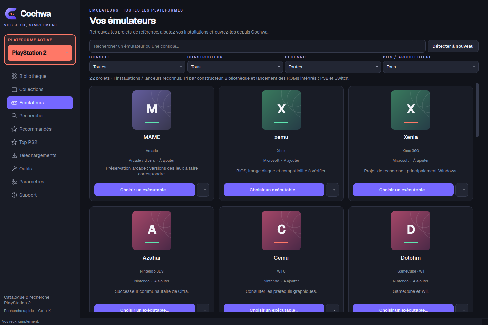

# Cochwa

**Votre bibliothèque de jeux rétro, simplement.** Cochwa vous aide à rechercher,
organiser et lancer vos jeux sur Linux, avec une interface graphique et une CLI.
La gestion intégrée des jeux est actuellement disponible pour PlayStation 2 et
Nintendo Switch.



## Ce que vous pouvez faire

- Parcourir votre bibliothèque et retrouver vos jeux installés.
- Rechercher des jeux et consulter leurs informations et jaquettes.
- Organiser vos jeux en collections sans déplacer les fichiers.
- Découvrir des recommandations et des classements pour chaque plateforme.
- Télécharger et vérifier des fichiers proposés par Internet Archive.
- Repérer vos émulateurs, enregistrer leur emplacement et les lancer depuis Cochwa.
- Utiliser IGDB en option pour enrichir le catalogue et ses métadonnées.
- Découvrir les fonctions principales avec le tutoriel du premier lancement, rejouable depuis Support.
- Piloter les fonctions principales depuis le terminal.

## Cochwa n’héberge aucun jeu

Cochwa est un logiciel local. Il ne fournit, n’héberge ni ne distribue de ROM ou
de fichier de jeu. Les recherches et téléchargements passent par des services
tiers ; lorsqu’un téléchargement est disponible, il est effectué depuis la
source concernée vers votre ordinateur. Vous devez disposer des droits
nécessaires pour les fichiers que vous utilisez.

## Installation

Prérequis : Linux, Python 3.11 ou plus récent, et `venv`/`pip`.

Depuis un terminal, dans le dossier du projet :

```bash
./install.sh
./run.sh
```

Le script installe Cochwa dans un environnement Python isolé du système. Pour
ouvrir directement la version terminal :

```bash
source .venv/bin/activate
.venv/bin/cochwa --help
```

Pour lancer les jeux, installez et configurez vous-même l’émulateur adapté. La
conversion optionnelle d’images disque demande également `chdman`.

## Configuration

Dans **Paramètres**, choisissez vos dossiers de jeux et configurez les lanceurs
disponibles. Vous pouvez aussi ajouter vos identifiants IGDB pour accéder à son
catalogue et à ses métadonnées. Les identifiants sont enregistrés dans votre
configuration locale.

Cochwa conserve ses réglages et son cache dans les dossiers utilisateur Linux
prévus à cet effet. Pour utiliser un autre fichier de réglages :

```bash
cochwa --config /chemin/vers/config.toml doctor
```

## Utiliser la CLI

```bash
# Afficher toutes les commandes
cochwa --help

# Rechercher un jeu PS2
cochwa search "gran turismo 4"

# Parcourir la bibliothèque locale
cochwa list --query "gran turismo"

# Vérifier un fichier ou un dossier de jeu
cochwa verify /chemin/vers/jeu.iso

# Vérifier la configuration de l’application
cochwa doctor
```

Chaque commande propose ses options avec `cochwa <commande> --help`. Depuis le
wrapper du projet, ajoutez `--cli`, par exemple `./run.sh --cli doctor`.

## Catalogue et classement

IGDB peut fournir des informations et des notes de critiques lorsque vous
configurez l’accès dans les paramètres. Les classements indiquent la source de
leurs notes ; une note IGDB n’est pas un score Metacritic. Les recommandations
et les résultats dépendent du catalogue disponible pour la plateforme. Pour
obtenir le Top Switch complet, renseignez vos identifiants IGDB ; une sélection
locale reste disponible pendant la première synchronisation.

## Aide et contributions

Consultez les commandes avec `cochwa --help` et les réglages dans **Paramètres**.
Les alias historiques `romget` et `romget-gui` restent disponibles pour les
installations qui les utilisent déjà.

## Description courte pour GitHub

> Bibliothèque de jeux rétro pour Linux : recherche, organisation et émulateurs PS2/Switch. Cochwa n’héberge aucun jeu.
