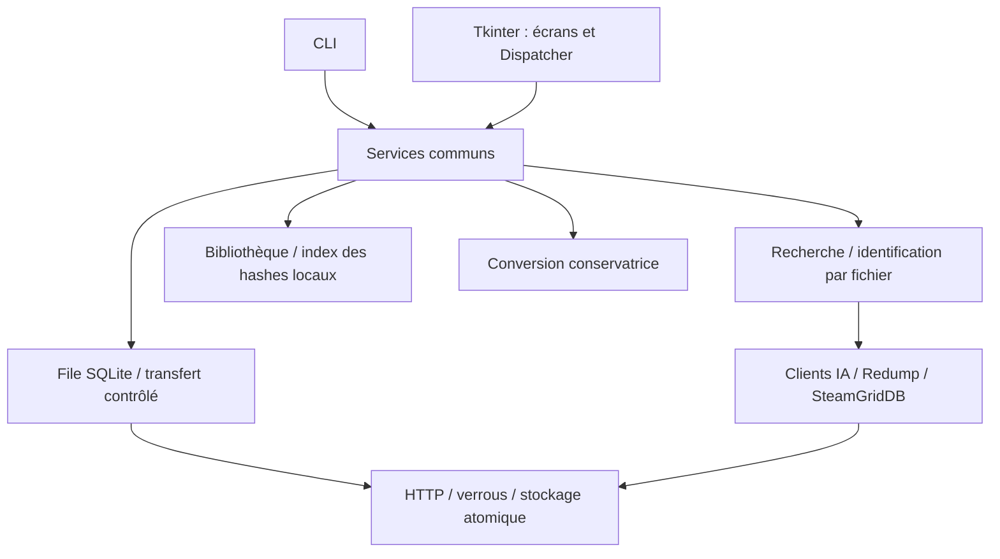

# Architecture 0.2

## Décisions

Conserver Python et Tkinter, ainsi que le paquet `romget/` à la racine : un layout `src/` n'est pas requis pour être professionnel et casserait les wrappers PYTHONPATH existants. La séparation des responsabilités et les tests sont plus importants qu'un déplacement cosmétique.

- `models.py` : résultats et identité source ; aucune dépendance UI.
- `infrastructure/` : sessions HTTP par thread, retries bornés, chemins confinés, fichiers temporaires et verrous interprocessus.
- `services/search.py` : pagination source, cache metadata, filtres et suggestions. Un pool global de quatre workers limite les metadata ; les verrous de cache dédupliquent les requêtes concurrentes.
- `services/download.py` : un fichier, sa provenance, sa reprise et sa validation. Échec = pas de publication finale. Aucun écrasement automatique des données existantes.
- `services/jobs.py` : sélections explicites persistées, un moteur actif par dossier d'état, pause/reprise et manifeste. Une sélection inachevée reste marquée pending et hors bibliothèque jouable.
- `services/library.py` et `index.py` : scan local, groupes CUE/pistes, manifestes et vérifications persistantes liées à taille/mtime. Un hash inconnu reste inconnu, notamment pour les mods.
- `gui/events.py` : seul le thread GUI appelle Tk. Les workers retournent des données via une queue ; les recherches périmées sont ignorées. Les dialogues et paramètres sont séparés de la composition de fenêtre.

## Formats et compatibilité

Config TOML existante conservée ; les paramètres non gérés ne sont pas supprimés. Cache datfile JSON historique accepté. Le vieux catalogue global IA est ignoré, jamais effacé. La file et l'index local utilisent SQLite stdlib. Les manifests `.romget.json` portent `schema: 1` et les fichiers effectivement sélectionnés. Les dossiers d'anciens jeux restent lisibles sans manifeste.

Les dossiers sont distincts par sélection (hash court d'identifiant, fichiers et racine). Cela évite de fusionner mods/éditions mais peut présenter deux sources du même jeu comme deux installations : la déduplication destructive n'est pas automatique.

## Limites délibérées

PS2 prioritaire, conformément à la décision utilisateur. Le champ plateforme et le contrat provider préparent l'extension, sans prétendre que l'ajout d'une console ne demande aucun adaptateur. Les métadonnées sont des dictionnaires validés aux frontières ; le modèle complet « édition/disque/piste » pourra être enrichi lorsque d'autres plateformes seront ajoutées.

Les empreintes IA/Redump servent à l'identification et au contrôle d'intégrité, pas à certifier l'authenticité cryptographique de leur provenance. L'URL Redump historique en HTTP reste configurable ; HTTPS n'a pas pu être validé pendant cette session.

Les mécanismes de confinement bloquent traversées et liens symboliques existants dans la destination. Ce programme personnel n'est pas une frontière de sécurité contre un autre processus local hostile qui modifie les répertoires pendant une écriture.
