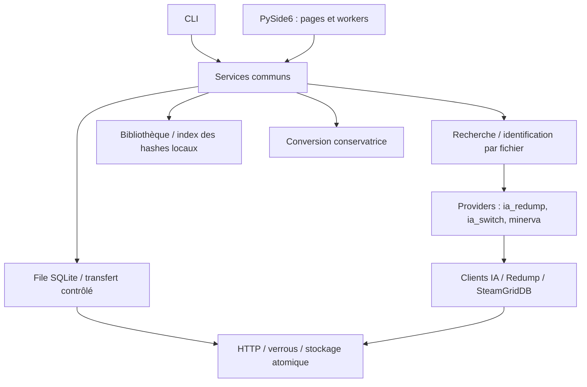

# Architecture 0.2

## Décisions

Conserver Python et le paquet `cochwa/` à la racine : un layout `src/` n'est pas requis pour être professionnel et casserait les wrappers existants. La séparation des responsabilités et les tests sont plus importants qu'un déplacement cosmétique.

L'interface graphique a été réécrite en **PySide6** (session 8) ; Tkinter a été supprimé. Le paquet a été renommé de `romget/` vers `cochwa/` (session 9) avec des alias de compatibilité pour les entry points.

- `models.py` : résultats et identité source ; aucune dépendance UI.
- `consoles.py` : registre des consoles (capacités, extensions, chemins par défaut) et `SearchProfile` — la stratégie de pertinence plateforme (termes exclus, collections IA) vit ici, pas dans les services.
- `infrastructure/` : sessions HTTP par thread, retries bornés, chemins confinés, fichiers temporaires et verrous interprocessus.
- `providers/ia_redump.py` : recherche IA paginée, cache metadata, identification Redump et ranking, alimentés par le `SearchProfile` de la console. Un pool global de workers limite les metadata ; les verrous de cache dédupliquent les requêtes concurrentes.
- `providers/ia_switch.py` et `providers/minerva.py` : sources Switch (NSP/XCI directs) et catalogue externe MiNERVA.
- `providers/base.py` : contrat de source et signature des providers.
- `services/search.py` : orchestration pure — sélection des sources par plateforme, dispatch parallèle, isolation des pannes, dédup et fusion des suggestions.
- `services/download.py` : un fichier, sa provenance, sa reprise et sa validation. Échec = pas de publication finale. Aucun écrasement automatique des données existantes.
- `services/jobs.py` : sélections explicites persistées, un moteur actif par dossier d'état, pause/reprise/suppression et manifeste. Une sélection inachevée reste marquée pending et hors bibliothèque jouable.
- `services/library.py` et `index.py` : scan local incrémental (snapshot `(path, size, mtime_ns)` en cache sqlite, invalidé à tout changement), groupes CUE/pistes, manifestes et vérifications persistantes liées à taille/mtime. Un hash inconnu reste inconnu, notamment pour les mods.
- `services/maintenance.py` : purge bornée des caches au démarrage (metadata IA expirées, marqueurs négatifs SGDB périmés ; jaquettes positives permanentes).
- `config.py` : chemins indexés par `console.id` (`console_dirs`/`console_launchers`, TOML `[roms] <id>_dir` / `[app] <id>_launcher`), sérialisation via `tomli-w`.
- `gui_qt/` : interface PySide6 complète — `theme.py` (palette + QSS), `workers.py` (threads thread-safe + `CoverService`), `toasts.py`, `cards.py` (`GameCard`), `grid.py` (`CardGrid` avec scroll et reflow), `pages/` (modules par page), `dialogs.py`, `app.py` (`MainWindow` avec sidebar à 7 entrées). Les workers retournent des données via signaux Qt ; les recherches obsolètes sont annulées au changement de console.

## Formats et compatibilité

Config TOML existante conservée ; les paramètres non gérés ne sont pas supprimés. Repli automatique sur l'ancien dossier XDG `romget` s'il existe ; les nouvelles installations utilisent `~/.config/cochwa/`. Cache datfile JSON historique accepté. Le vieux catalogue global IA est ignoré, jamais effacé. La file et l'index local utilisent SQLite stdlib. Les manifests `.romget.json` portent `schema: 1` et les fichiers effectivement sélectionnés. Les dossiers d'anciens jeux restent lisibles sans manifeste.

Les dossiers sont distincts par sélection (hash court d'identifiant, fichiers et racine). Cela évite de fusionner mods/éditions mais peut présenter deux sources du même jeu comme deux installations : la déduplication destructive n'est pas automatique.

## Limites délibérées

PS2 prioritaire, conformément à la décision utilisateur. Le champ plateforme et le contrat provider préparent l'extension, sans prétendre que l'ajout d'une console ne demande aucun adaptateur. Les métadonnées sont des dictionnaires validés aux frontières ; le modèle complet « édition/disque/piste » pourra être enrichi lorsque d'autres plateformes seront ajoutées.

Les empreintes IA/Redump servent à l'identification et au contrôle d'intégrité, pas à certifier l'authenticité cryptographique de leur provenance. L'URL Redump historique en HTTP reste configurable ; HTTPS n'a pas pu être validé pendant cette session.

Les mécanismes de confinement bloquent traversées et liens symboliques existants dans la destination. Ce programme personnel n'est pas une frontière de sécurité contre un autre processus local hostile qui modifie les répertoires pendant une écriture.
